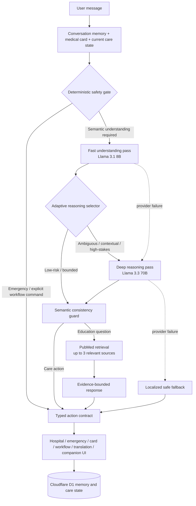
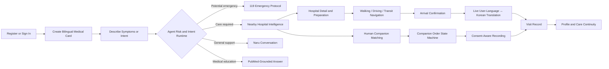
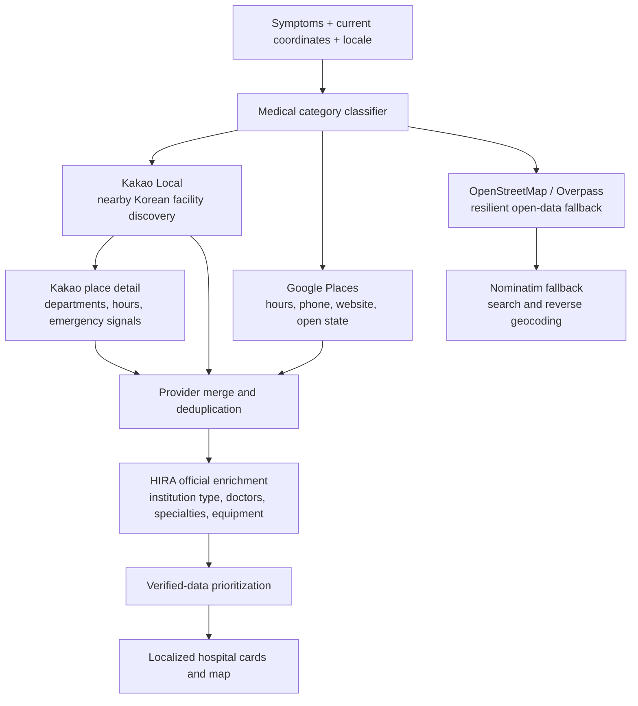
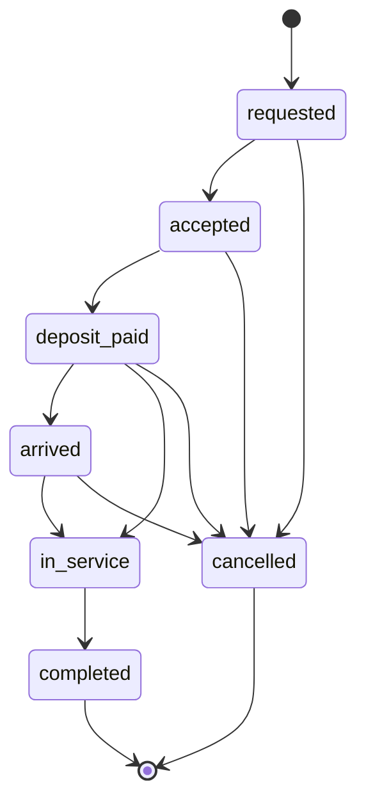

<div align="center">


<h1>NaruCare</h1>

<h3>Agentic Healthcare Access Infrastructure for Foreign Nationals in Korea</h3>

<p><strong>Adaptive medical reasoning. Multi-source hospital intelligence. Cross-lingual care orchestration.</strong></p>

[](https://yuri925830.github.io/NaruCare/)
[](./package.json)
[](https://react.dev/)
[](https://www.typescriptlang.org/)
[](https://workers.cloudflare.com/)
[](#agent-decision-fabric)
[](#global-language-runtime)
[](https://github.com/Yuri925830/NaruCare/actions/workflows/deploy-pages.yml)

<br />

<em>Healthcare access should not fail at the language boundary.</em>

</div>

---

# NaruCare in One Sentence

**NaruCare is a stateful Agentic AI healthcare access system that helps foreign nationals in Korea understand what to do next, locate appropriate care, navigate the Korean hospital workflow, communicate across languages, and escalate safely when the situation may be urgent.**

It is not an “AI doctor.”

It is the coordination layer between a person in distress and the real-world systems required to receive care.

---

# Why This Exists

Getting medical help in a foreign country is not a single question-and-answer problem.

It is a sequence of connected decisions:

```text
What is happening?
    → Is this potentially urgent?
        → What kind of care is appropriate?
            → Which real facility is nearby and relevant?
                → Is it open, reachable, and prepared for this need?
                    → What should the patient bring?
                        → How does the hospital process work?
                            → How can the patient and Korean staff understand each other?
                                → What must be remembered after the visit?
```

Most products fragment this journey across chatbots, map applications, translation tools, hospital directories, emergency calls, and handwritten notes.

NaruCare compiles those fragmented steps into one persistent care loop.

> **This is not a chatbot with healthcare copy. It is an agent runtime with healthcare boundaries.**

---

# What Makes NaruCare Agentic

NaruCare does not merely generate a response and wait for the next prompt.

It continuously combines:

- authenticated identity
- bilingual medical-card state
- current symptoms and symptom evolution
- prior conversation memory
- location and hospital category
- selected facility and route state
- visit workflow progress
- translation context
- companion order state
- emergency progression
- persisted visit records

The agent interprets the user’s current intent, selects the least expensive safe reasoning path, validates the result against deterministic rules, and then moves the interface into the appropriate real-world workflow.

```text
Understand
    → Assess risk
        → Select reasoning depth
            → Validate action
                → Open the correct workflow
                    → Persist state
                        → Continue the care journey
```

The model can interpret language.

The application owns consequences.

---

# Agent Decision Fabric

NaruCare uses a layered decision architecture rather than sending every message directly to one large model.



## Adaptive Reasoning

The first model pass determines intent, confidence, symptom state, and the currently active symptom summary.

A deterministic reasoning selector escalates the request to the deeper model when the message contains signals such as:

- emergency risk
- low-confidence ambiguity
- medication safety or interaction questions
- evolving or multi-factor symptoms
- context-dependent follow-up language
- contradictions, corrections, or unresolved references
- multi-step comparisons or unusually detailed reports
- disagreement between the semantic model and local safety rules

Simple greetings, lightweight conversation, and bounded low-risk requests stay on the fast path.

Complexity pays for complexity.

## Consistency Guard

A model is not allowed to trigger a high-consequence action without internally consistent evidence.

Examples:

- `hospital` or `emergency` intent without an active symptom summary is rejected or repaired
- deterministic symptom rules override an inconsistent model downgrade
- resolved symptoms clear the active symptom state
- general and education responses cannot silently retain medical-action symptoms
- invalid JSON, empty output, timeouts, and provider errors fall through explicit recovery contracts
- every response exposes its execution class as `deterministic`, `light`, `deep`, or `fallback`

## Stateful Conversation Memory

NaruCare persists authenticated chat history in Cloudflare D1.

The runtime restores recent conversation after refresh, reasons over corrections and symptom changes, and keeps a bounded history window rather than treating each sentence as an isolated request.

This allows the agent to understand transitions such as:

```text
“My stomach has hurt for three days.”
    → “I vomited yesterday.”
        → “I am not vomiting now, but I still have a fever.”
```

The active state is **persistent fever and improving abdominal symptoms**, not a transcript dump of every sentence.

---

# Core Doctrine

NaruCare is governed by explicit engineering contracts.

## Navigation Before Diagnosis

The system may structure symptoms, identify risk signals, explain workflows, translate communication, retrieve educational evidence, and route the user toward care.

It does not diagnose, prescribe, or replace a physician, pharmacist, emergency dispatcher, or licensed medical professional.

## Emergency Access Is Never Gated

A bilingual medical card improves continuity, but it never blocks the 119 pathway.

A user without a completed card can still share location, initiate a call, generate a Korean emergency statement, and enter live translation support.

## Deterministic State, Bounded Intelligence

Application code owns:

- authentication and authorization
- emergency activation
- medical-card gating
- workflow transitions
- route construction
- companion order state
- recording authorization
- database mutation
- deletion and ownership boundaries

AI is constrained to interpretation, language mediation, evidence-bounded education, and supportive guidance.

## Provenance Before Presentation

Hospital information is fused from real external providers.

Unknown opening hours, reservation rules, specialist data, or emergency capability remain visibly unknown. NaruCare does not invent operational certainty to make a card look complete.

## Human Control at Consequential Boundaries

The browser cannot silently place a phone call, confirm that 119 answered, authorize recording, complete a real payment, or guarantee hospital acceptance.

Those transitions require explicit user action.

## Graceful Degradation by Design

AI, maps, hospital providers, geocoding, routing, speech recognition, translation, and external navigation are isolated behind failure contracts.

A provider outage may reduce capability.

It must not corrupt persisted care state.

> **The agent may coordinate the care journey. It may never fabricate clinical authority.**

---

# End-to-End Care Loop



The operating loop is intentionally stateful:

> **Identify → Understand → Reason → Route → Navigate → Translate → Coordinate → Record**

---

# Product Surface

| Surface | What it does |
| --- | --- |
| Authentication | ID/password registration, login, session persistence, logout |
| Naru Agent | Contextual conversation, adaptive reasoning, risk routing, action transitions |
| Medical Card | Bilingual identity, insurance, conditions, medication, surgery, symptoms, location |
| Nearby Hospitals | Symptom-aware facility category, live provider fusion, schedules, provenance, official enrichment |
| Visit Workflow | Appointment guidance, required documents, preparation, registration, payment, prescription flow |
| Navigation | Naver map experience, driving and walking routes, external transit handoff |
| Translation | User-language ↔ Korean text, speech recognition, transcription, speech synthesis |
| Medical Education | PubMed retrieval and evidence-bounded educational responses |
| Human Companion | Filtering, matching, order lifecycle, service timing, recording, rating |
| Emergency | Location, explicit 119 call, Korean broadcast, live translation |
| Visit Records | Hospital, department, symptoms, status, translation history, companion context |
| Profile | Medical-card access, records, orders, longitudinal care continuity |

Desktop and mobile surfaces share one care-state model.

---

# Multi-Source Hospital Intelligence

Nearby care is not retrieved from a single directory.

NaruCare runs a provider-fusion pipeline optimized for Korean medical access.



## Provider Strategy

### Kakao Local

- Korea-native nearby facility discovery
- distance-ranked results
- phone, address, category, and place URL
- place-detail enrichment for published departments and operating information

### Google Places

- operating schedules and current open state
- phone, website, facility type, and map URI
- supplementary emergency and reservation signals
- merged against Kakao results by normalized name and phone

### HIRA Official Data

When configured, the Health Insurance Review & Assessment Service enrichment layer adds official institutional metadata such as:

- institution type
- total doctor count
- clinical departments
- specialist counts
- medical equipment
- special-care capabilities

HIRA enrichment is time-bounded and cached at the edge so official-data latency does not block the hospital screen.

### OpenStreetMap Resilience Layer

If primary commercial providers are unavailable, NaruCare falls back through:

- multiple Overpass endpoints
- Nominatim bounded search
- localized name fields
- source URLs and published metadata

## Truth Model

Every hospital object can expose:

```text
identity
coordinates
distance
facility type
address
opening hours
current open state
emergency capability
reservation evidence
telephone
website
data source
source URL
verification date
official institution type
doctor count
specialties
specialists
equipment
special-care capabilities
```

Missing values remain missing.

**Unknown is a first-class state.**

---

# Navigation Runtime

NaruCare bridges facility discovery and arrival.

- Naver Dynamic Map in the primary navigation workspace
- traffic-aware driving geometry through Naver Directions 5
- walking route geometry through OSRM
- route distance, duration, and polyline rendering
- resilient Leaflet fallback when the primary map runtime is unavailable
- user-selectable Naver Maps, Google Maps, and Kakao Maps handoff
- public-transit handoff to native map applications
- arrival confirmation that opens the translation workspace

The route is not the end of the workflow.

Arrival is a state transition.

---

# Intelligence Plane

NaruCare is AI-native, not AI-dependent.

## Model Topology

| Workload | Runtime | Contract |
| --- | --- | --- |
| Deterministic safety and workflow routing | TypeScript rules in Cloudflare Worker | Immediate emergency and explicit-action control |
| Fast semantic understanding | Workers AI · Llama 3.1 8B Instruct Fast | Low-latency intent, confidence, symptom-state, and reply pass |
| Deep medical-context reasoning | Workers AI · Llama 3.3 70B Instruct FP8 Fast | Ambiguous, contextual, evolving, or high-stakes requests |
| Evidence synthesis | PubMed E-utilities + bounded model pass | Medical education grounded only in retrieved evidence |
| Cross-lingual medical translation | Workers AI · M2M100 1.2B | Translation-only output without added diagnosis |
| Voice transcription fallback | Workers AI · Whisper Large v3 Turbo | Medical-context transcription preserving names and numbers |
| Immediate voice input | Browser Web Speech API | Low-latency recognition when supported |
| Voice playback | Browser Speech Synthesis | Spoken handoff for patient, staff, and emergency scenarios |

## Typed Response Contract

```text
User input
    → deterministic safety gate
        → semantic understanding
            → adaptive reasoning tier
                → schema validation
                    → consistency guard
                        → optional evidence retrieval
                            → typed response
                                → explicit UI action
                                    → persisted state transition
```

Model output is never treated as trusted application state until it passes validation.

---

# Evidence-Bounded Medical Education

General medical questions are separated from personal symptom routing.

For eligible education requests, NaruCare:

1. generates a concise English PubMed query
2. retrieves up to three relevant articles through NCBI E-utilities
3. bounds external response sizes and request time
4. extracts title, year, PMID, and abstract text
5. asks the model to use only the supplied evidence
6. returns inline source markers and source links
7. preserves the boundary against diagnosis and personalized dosing

Medication questions receive additional safeguards: the system does not instruct the user to start, stop, or change prescription medication without a clinician or pharmacist.

Retrieval can fail independently without breaking the wider care journey.

---

# Global Language Runtime

Language switching is application state, not a decorative selector.

- 28 interface languages
- Chinese, Korean, English, and Japanese maintained as primary authored packs
- 24 additional locale packs generated and validated at build time
- whole-screen localization across authentication, navigation, cards, workflows, maps, emergency screens, companions, records, and Naru messages
- Korean retained beside the user’s language when a clinical handoff benefits from mutual readability
- multilingual symptom understanding across colloquial, mixed-language, and incomplete input
- browser speech recognition plus recorded-audio transcription fallback
- speech synthesis for translated utterances

The goal is not isolated translated pages.

The goal is multilingual continuity.

---

# Bilingual Medical Identity

The medical card creates a persistent bridge between the user’s language and Korean clinical communication.

It can store:

- name and nationality
- age and gender
- identity-document type and number
- insurance status
- current address and coordinates
- chronic conditions
- current medication
- surgery history
- active symptoms
- clinical notes
- preferred language
- Korean representations of medical fields

Location can be acquired from the browser, reverse-geocoded, corrected manually, and extended down to building, floor, unit, or room detail.

Non-emergency care workflows may require the medical card.

Emergency access never does.

---

# Multilingual Voice Mediation

The translation workspace supports:

- user-language → Korean communication
- Korean → user-language communication
- browser-native speech recognition
- Whisper transcription fallback for recorded audio
- browser speech synthesis
- patient/staff speaker separation
- preservation of symptoms, medicine names, proper nouns, and numeric detail
- translation entries appended to the visit record

A failed translation is never cached as successful output.

Source text is never silently relabeled as translated content.

---

# 119 Emergency Protocol

The emergency pathway is designed around browser and human-control realities.

- available with or without a completed medical card
- current-location acquisition with address fallback
- explicit `tel:119` call action
- Korean emergency statement generated from identity, location, and symptoms
- symptom translation before dispatcher playback
- safe fallback when symptom context is unknown
- repeated Korean speech only after the user confirms the call is connected
- immediate transition into live translation support

The browser cannot silently dial 119 or verify that a dispatcher answered.

NaruCare makes that boundary visible instead of simulating certainty.

---

# Human-in-the-Loop Companion Orchestration

The competition build includes seeded companion profiles that demonstrate the orchestration model.

Capabilities include:

- language, gender, nationality, age, rating, price, ETA, and hospital-experience filtering
- deterministic match scoring
- companion detail and request flow
- service-duration selection and deposit calculation
- persisted orders
- rating and review
- private recording chunks during an authorized service
- order deletion coupled to recording deletion

The order lifecycle is enforced as a finite-state machine:



Invalid transitions are rejected by the Worker.

The seeded profiles demonstrate product behavior. They are not represented as already contracted real-world personnel.

---

# Visit Continuity

A care interaction should survive more than one screen.

NaruCare persists:

- hospital and department
- symptoms
- visit date and status
- selected hospital context
- translation history
- companion order context
- service metadata
- structured visit details

Records are authorization-bound to the authenticated user and can be updated or deleted.

Deleting a record linked to a companion recording also removes the associated private media objects.

---

# System Architecture

```mermaid
flowchart TB
    subgraph Experience["Experience Plane"]
        Web["React 19 + TypeScript + Vite"]
        UI["Responsive care workflows"]
        Map["Naver Dynamic Map + Leaflet"]
        Speech["Web Speech + MediaRecorder"]
        IP["NaruPose 3D IP runtime"]
    end

    subgraph Agent["Agent Control Plane"]
        Worker["Cloudflare Worker API"]
        Safety["Deterministic safety gate"]
        Tier["Adaptive reasoning selector"]
        Schema["Typed response validation"]
        Memory["Conversation and care-state orchestration"]
    end

    subgraph Models["Intelligence Plane"]
        Fast["Llama 3.1 8B Fast"]
        Deep["Llama 3.3 70B"]
        Translate["M2M100"]
        Whisper["Whisper Large v3 Turbo"]
        PubMed["PubMed retrieval"]
    end

    subgraph State["State and Media Plane"]
        D1[("Cloudflare D1")]
        R2[("Private Cloudflare R2")]
    end

    subgraph Geo["Korean Medical Data Plane"]
        Kakao["Kakao Local / place detail"]
        Google["Google Places"]
        HIRA["HIRA official APIs"]
        OSM["OpenStreetMap / Overpass"]
        Nominatim["Nominatim"]
        Naver["Naver Directions 5"]
        OSRM["OSRM"]
    end

    Web --> UI
    Web --> Map
    Web --> Speech
    Web --> Worker

    Worker --> Safety
    Safety --> Tier
    Tier --> Fast
    Tier --> Deep
    Worker --> Schema
    Worker --> Memory
    Worker --> Translate
    Worker --> Whisper
    Worker --> PubMed

    Worker --> D1
    Worker --> R2

    Worker --> Kakao
    Worker --> Google
    Worker --> HIRA
    Worker --> OSM
    Worker --> Nominatim
    Worker --> Naver
    Worker --> OSRM
```



The architecture separates concerns that must never collapse into one another:

- **Experience state** — language, visual hierarchy, map state, microphone state, responsive navigation
- **Care state** — card readiness, symptoms, selected hospital, visit phase, translation phase, emergency phase
- **Persistent state** — users, sessions, cards, chat memory, orders, records, translation cache, recording metadata
- **Model execution** — reasoning tier, timeout isolation, schema validation, evidence boundaries, fallback contracts
- **External truth** — facility provenance, coordinates, schedules, official metadata, route geometry
- **Consequential control** — calls, recording, payment representation, deletion, and human confirmation

---

# Data and Security Model

Healthcare software earns trust through boundaries.

## Authentication Boundary

- arbitrary ID/password registration; no phone number or email required
- PBKDF2-SHA-256 password derivation
- per-user random salt
- 100,000 derivation iterations
- cryptographically random bearer tokens
- only SHA-256 token hashes persisted
- constant-time credential comparison
- server-side session expiry
- origin-aware CORS
- authorization resolved on every protected request

## Persistence Boundary

Cloudflare D1 stores:

- users
- sessions
- bilingual medical cards
- chat memory
- companion profiles and orders
- visit records
- translation cache
- recording metadata

Foreign keys and server-side ownership checks bind data to the authenticated user.

## Media Boundary

- recording chunks stored in a private R2 bucket
- raw account IDs excluded from object keys
- hashed user namespace
- write access restricted to authorized `in_service` or `completed` orders
- chunk index, size, content type, ownership, and order state validated
- deleting an order or linked record removes associated recording objects

## Input and Provider Boundary

- JSON body size limits
- audio and recording payload limits
- coordinate range validation
- bounded external response sizes
- provider timeouts
- parameter-bound D1 statements
- invalid model schemas rejected
- failed translation output never cached
- no production secret committed to the repository

Security is not a settings screen.

It is an execution contract.

---

# Reliability Engineering

NaruCare is designed to preserve the care journey across partial failure.

- deterministic emergency and explicit-action routing remains available independently of the large model
- light and deep reasoning models form a bidirectional fallback cascade
- localized safe responses handle total reasoning-provider failure
- hospital discovery fuses primary providers and open-data fallbacks
- HIRA enrichment is optional, time-bounded, and edge-cached
- schedules can be prioritized without inventing missing hours
- reverse geocoding uses Korea-native primary data with open fallback
- route providers fail independently
- chat memory, visit records, and orders remain durable across refresh
- invalid order transitions are rejected
- translation cache stores only validated output
- external-data failure never rewrites durable care state
- emergency access remains independent of medical-card completion
- structured request logs include reasoning tier and escalation reasons
- Worker observability is enabled

Graceful degradation is a runtime property, not an incident-response slogan.

---

# Technology Stack

| Plane | Technology | Responsibility |
| --- | --- | --- |
| Experience | React 19, TypeScript, Vite 8 | Typed responsive web application |
| UI Runtime | Custom component system, Lucide React | Care workflows and interaction primitives |
| Mapping | Naver Dynamic Map, Leaflet | Korean navigation context and resilient map fallback |
| Edge Control | Cloudflare Workers | Authentication, safety routing, agent orchestration, provider isolation |
| Relational State | Cloudflare D1 | Identity, cards, memory, orders, records, translation cache |
| Media State | Private Cloudflare R2 | Authorized companion recording chunks |
| Fast Reasoning | Workers AI · Llama 3.1 8B Instruct Fast | Low-latency semantic understanding |
| Deep Reasoning | Workers AI · Llama 3.3 70B Instruct FP8 Fast | Complex and high-stakes context synthesis |
| Translation | Workers AI · M2M100 1.2B | Cross-lingual medical mediation |
| Speech | Web Speech API, Whisper Large v3 Turbo | Immediate and fallback voice input |
| Evidence | PubMed / NCBI E-utilities | Medical education retrieval |
| Korean Facility Data | Kakao Local, Google Places, HIRA | Discovery, schedules, and official enrichment |
| Open Geo Fallback | OpenStreetMap, Overpass, Nominatim | Resilient facility and address data |
| Routing | Naver Directions 5, OSRM | Driving and walking geometry |
| Distribution | GitHub Pages, GitHub Actions | Static frontend deployment |
| Quality | Vitest, TypeScript, Playwright Core | Logic, type, build, and visual validation |

---

# Repository Map

```text
NaruCare/
├── public/
│   └── naru/                       # Reusable Naru character states
├── scripts/
│   ├── extract-naru-poses.py       # Deterministic character asset pipeline
│   ├── generate-countries.mjs      # Country dataset generation
│   ├── generate-locales.mjs        # Locale-pack generation and validation
│   └── visual-check.mjs            # Desktop/mobile acceptance harness
├── src/
│   ├── pages/                      # Authentication, care, companion, emergency, profile
│   ├── App.tsx                     # Shared client care-state runtime
│   ├── api.ts                      # Typed API client and demo fallbacks
│   ├── components.tsx              # Reusable UI, maps, panels, Naru poses
│   ├── i18n.tsx                    # 28-language application runtime
│   ├── triage.ts                   # Deterministic intent and safety layer
│   ├── reasoningTier.ts            # Light/deep reasoning selector
│   ├── hospitalMatching.ts         # Symptom-to-facility category matching
│   ├── hiraHospital.ts             # HIRA parsing and official-data matching
│   ├── kakaoHospitalDetail.ts      # Kakao detail normalization
│   ├── hospitalHours.ts            # Seoul-time operating schedule evaluation
│   ├── location.ts                 # Geolocation and location-state utilities
│   └── types.ts                    # Shared typed contracts
├── worker/
│   ├── migrations/                 # Versioned D1 schema evolution
│   ├── src/index.ts                # Edge API and orchestration control plane
│   └── wrangler.jsonc              # Workers, D1, R2, AI, observability bindings
├── .github/workflows/
│   └── deploy-pages.yml            # Typed GitHub Pages deployment
├── package.json
└── README.md
```

---

# API Surface

```text
POST   /api/auth/register
POST   /api/auth/login
POST   /api/auth/logout
GET    /api/me

PUT    /api/card

GET    /api/hospitals
GET    /api/location/reverse
GET    /api/maps/config
GET    /api/route

POST   /api/chat
GET    /api/chat/history
POST   /api/chat/memory
DELETE /api/chat/history

POST   /api/translate
POST   /api/transcribe

POST   /api/companions
POST   /api/orders
GET    /api/orders
PATCH  /api/orders/:id
DELETE /api/orders/:id
PUT    /api/orders/:id/recordings/:chunk

POST   /api/records
GET    /api/records
PATCH  /api/records/:id
DELETE /api/records/:id

GET    /api/health
```

Protected resources require an authenticated bearer session.

---

# Quality Engineering

The validation surface covers far more than rendering.

Current automated suites exercise areas including:

- deterministic triage and emergency routing
- symptom extraction, negation, recovery, and continuity
- adaptive light/deep reasoning selection
- inconsistent low-confidence action rejection
- hospital-category matching
- HIRA XML parsing, capability normalization, and facility matching
- Kakao hospital-detail parsing
- opening-hours evaluation
- geolocation and address-state behavior
- country and locale data integrity
- companion billing and service-duration limits
- responsive visual flow across core desktop and mobile scenarios

Run the full local baseline:

```bash
npm run typecheck
npm test
npm run build
npm run worker:check
npm run visual:check
```

The quality bar is not that a healthcare screen renders.

The quality bar is that the care journey remains coherent across every legitimate state transition.

---

# Local Development

## Requirements

- Node.js 24
- npm
- a modern browser with geolocation and microphone support
- Chrome on Windows for the visual-acceptance script

## Start the Full Stack

```bash
npm ci
npx wrangler d1 migrations apply narucare --local --config worker/wrangler.jsonc
npm run dev
```

The frontend runs on:

```text
http://localhost:5173
```

The local Worker runs on:

```text
http://localhost:8787
```

Vite proxies `/api` to the Worker development runtime.

## Frontend-Only Mode

```bash
npm run dev:web
```

Selected competition surfaces can fall back to browser-side demonstration state when the API is unavailable.

A formal deployment should always define the production Worker origin.

---

# Configuration

Create local Worker secrets in `worker/.dev.vars` or configure encrypted production secrets through Wrangler.

```text
KAKAO_REST_API_KEY
GOOGLE_PLACES_API_KEY
HIRA_SERVICE_KEY
NAVER_MAPS_CLIENT_ID
NAVER_MAPS_CLIENT_SECRET
```

Frontend production variable:

```text
VITE_API_URL
```

The browser receives only the domain-restricted client ID required by the official Naver Dynamic Map SDK.

Provider secrets, Directions requests, database access, model execution, and authorization remain behind the Worker boundary.

---

# Cloudflare Deployment

## Provisioned Bindings

```text
DB           → Cloudflare D1 / narucare
RECORDINGS   → Private Cloudflare R2 / narucare-recordings
AI           → Cloudflare Workers AI
```

## Deploy the Backend

```bash
npx wrangler login

npm run worker:types
npx wrangler d1 migrations apply narucare --remote --config worker/wrangler.jsonc
npm run worker:check

npx wrangler secret put KAKAO_REST_API_KEY --config worker/wrangler.jsonc
npx wrangler secret put GOOGLE_PLACES_API_KEY --config worker/wrangler.jsonc
npx wrangler secret put HIRA_SERVICE_KEY --config worker/wrangler.jsonc
npx wrangler secret put NAVER_MAPS_CLIENT_ID --config worker/wrangler.jsonc
npx wrangler secret put NAVER_MAPS_CLIENT_SECRET --config worker/wrangler.jsonc

npx wrangler deploy --config worker/wrangler.jsonc --minify
```

Live health endpoint:

[`https://narucare-api.narucare-rich925.workers.dev/api/health`](https://narucare-api.narucare-rich925.workers.dev/api/health)

---

# GitHub Pages Deployment

1. Set `Settings → Pages → Source` to **GitHub Actions**.
2. Create the repository Actions variable `VITE_API_URL`.
3. Set it to the deployed Worker origin.
4. Push to `main`.
5. `.github/workflows/deploy-pages.yml` runs the typed production build and Pages deployment.

Live frontend:

[`https://yuri925830.github.io/NaruCare/`](https://yuri925830.github.io/NaruCare/)

Vite uses relative asset paths so the same build can operate under the repository subpath or a future custom domain.

---

# Naru 3D IP Runtime

Naru is not a flat mascot placed over a generic dashboard.

The product uses one coherent visual system: warm ceramic neutrals, soft-polymer volume, controlled specular highlights, rounded surfaces, and restrained clinical contrast.

<div align="center">


<p><em>Reusable transparent character states distributed across the care journey.</em></p>

</div>

The asset pipeline includes:

- deterministic extraction from the source character sheet
- transparent RGBA output
- alpha-bound metadata
- contact-sheet validation
- one reusable `NaruPose` component
- semantic pose placement across authentication, card, agent, hospital, navigation, translation, companion, emergency, and profile contexts

```bash
npm run naru:extract
```

The character system is product architecture, not post-production decoration.

---

# Production Boundary

NaruCare is a deployable competition-grade system.

It is not a licensed medical device and is not a substitute for professional medical judgment.

Before real clinical operation at scale, the following responsibilities remain:

- real companion recruitment, identity verification, credential review, scheduling, insurance, and dispute handling
- Korean privacy-law review, consent policy, retention controls, audit access, and deletion governance
- signed payment intents, provider callbacks, refunds, and settlement reconciliation
- commercial service-level agreements for hospital schedule and reservation completeness
- emergency-policy validation with Korean legal, clinical, and public-safety stakeholders
- accessibility certification
- rate limiting, abuse prevention, incident response, alerting, and security assessment
- formal clinical-safety evaluation and post-market monitoring

NaruCare supports access, communication, navigation, and coordination.

It does not diagnose, prescribe, guarantee hospital acceptance, or replace emergency professionals.

Operational honesty is part of the architecture.

---

# Roadmap

- streaming translation with speaker-aware conversation memory
- structured pre-arrival handoff for hospital staff
- verified real-world companion onboarding and dispatch
- signed payments, refunds, settlement, and dispute workflows
- consent ledger and automated recording-retention policies
- patient-controlled record export
- push notifications and retryable background orchestration
- expanded observability, rate limiting, abuse detection, and operational dashboards
- native mobile packaging and device-level emergency integration
- formal Korean healthcare, privacy, accessibility, and clinical-safety compliance

---

# Current Status

**Release:** `v1.0.0`

**Stage:** live competition deployment

**Frontend:** deployed on GitHub Pages

**Backend:** deployed on Cloudflare Workers

**Agent runtime:** deterministic safety gate + adaptive light/deep reasoning + model cascade + safe fallback

**Hospital intelligence:** Kakao + Google Places + HIRA + OpenStreetMap resilience

**Care continuity:** bilingual identity + persistent chat memory + navigation + translation + records + companion workflow

NaruCare has progressed beyond a collection of healthcare screens.

It is now a shared-state care operating loop in which language, risk, geography, workflow, human assistance, and durable memory operate as one coordinated system.

---

<div align="center">


<h3>NaruCare</h3>

<p><strong>Borderless care, engineered as infrastructure.</strong></p>

<p><em>Understand the moment. Route the risk. Coordinate the journey.</em></p>

</div>
