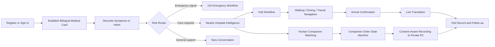
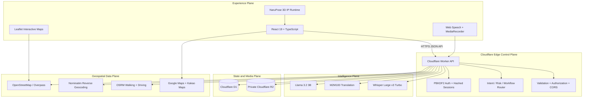

<div align="center">


<h1>NaruCare</h1>

<h3>AI-Native Healthcare Operating System for Foreign Nationals in Korea</h3>

<p><strong>Cross-lingual care orchestration. Geospatial medical intelligence. Human-centered emergency infrastructure.</strong></p>

[](./package.json)
[](https://react.dev/)
[](https://www.typescriptlang.org/)
[](https://workers.cloudflare.com/)
[](https://developers.cloudflare.com/d1/)
[](https://developers.cloudflare.com/r2/)
[](https://developers.cloudflare.com/workers-ai/)
[](#global-language-runtime)
[](#quality-engineering)
[](https://github.com/Yuri925830/NaruCare/actions/workflows/deploy-pages.yml)

<br />

<em>Borderless care, engineered as infrastructure.</em>

</div>

---

# Vision

Healthcare access in a foreign country is not a conversation problem.

It is an orchestration problem.

A patient in distress must move through language, identity, geography, hospital operations, transportation, emergency response, and human coordination—often while navigating pain, uncertainty, and an unfamiliar medical system.

NaruCare turns that fragmented journey into one stateful operating loop.

It establishes a bilingual medical identity, interprets the user's immediate intent, routes risk, discovers real nearby care, explains the Korean hospital workflow, coordinates navigation and translation, activates an explicit 119 pathway when required, and preserves continuity across the entire encounter.

The system continuously answers the questions that matter at the moment of care:

- What does the patient need right now?
- Is this a navigation problem or an emergency?
- Which nearby medical facilities are real, relevant, and reachable?
- What information is verified, unavailable, or still requires a phone call?
- How can the patient and Korean medical staff understand one another?
- When should automation stop and a human take control?

> **Access to care should not collapse at the language boundary.**

---

# Product Thesis

Most healthcare assistants are optimized to produce answers.

NaruCare is engineered to coordinate action.

The product treats the foreign-patient journey as **structured, stateful, safety-bounded orchestration** rather than a collection of disconnected chat screens. Identity, symptoms, location, hospital selection, route state, translation context, companion state, and emergency behavior operate against the same user journey.

NaruCare unifies systems that are usually fragmented across separate applications:

- A multilingual medical access layer
- A geospatial hospital intelligence layer
- A bounded AI interpretation layer
- An emergency communication workflow
- A human-in-the-loop companion orchestration layer
- A persistent care-state and recording layer

This is not another medical chatbot.

This is an AI-native healthcare operating system for foreign nationals in Korea.

---

# Core Doctrine

NaruCare is governed by explicit engineering contracts.

### Navigation Before Diagnosis

The system can structure symptoms, identify risk signals, explain workflows, translate communication, and route the user toward care. It does not claim to replace a physician, emergency dispatcher, or licensed medical professional.

### Emergency Access Is Never Gated

The medical card improves continuity, but it never blocks the emergency pathway. A user without a card can still share location, initiate a 119 call, and activate the Korean emergency broadcast flow.

### Provenance Before Presentation

Hospital identity, coordinates, metadata, and source links remain traceable to real providers such as OpenStreetMap. Missing operating hours or reservation policies are displayed as unverified—not inferred into false certainty.

### Deterministic State, Bounded Intelligence

Application code owns authentication, authorization, card gating, order transitions, recording boundaries, routing contracts, and persistence. AI is constrained to language, interpretation, and supportive guidance.

### Human Control at Consequential Boundaries

The browser cannot silently place a phone call, confirm that 119 answered, authorize recording, or complete a real payment. These transitions remain explicit user actions.

### Graceful Degradation by Design

Map, AI, speech, hospital data, and external navigation are isolated behind clear failure states. A provider outage must not corrupt the user's persisted care state.

> **The agent may coordinate the care journey. It may never fabricate clinical authority.**

---

# Care Orchestration Loop



The operating loop is intentionally stateful:

> **Identify → Understand → Route → Navigate → Translate → Coordinate → Record**

---

# System Architecture



The architecture separates five concerns that must never collapse into one another:

- **Experience state** — language, responsive interaction, map state, voice state, visual hierarchy, and the Naru character system
- **Care state** — medical-card readiness, selected hospital, visit phase, companion phase, and emergency progression
- **Persistent state** — users, sessions, bilingual cards, orders, visit records, translation cache, and recording metadata
- **Model execution** — conversation, translation, transcription, timeout isolation, and explicit failure contracts
- **External truth** — hospital provenance, geocoding, route geometry, navigation handoff, and unverifiable data boundaries

The frontend can be deployed independently. The API can evolve without rebuilding the data plane. AI can fail without rewriting durable care state. R2 media remains private and addressable only through authorized order context.

---

# Intelligence Plane

NaruCare is AI-native, not AI-dependent.

Language models do not own authentication, medical-card gating, emergency activation, route construction, payment state, recording authorization, or database mutation. Those behaviors are enforced by deterministic application logic.

## Model Topology

| Workload | Runtime | Contract |
| --- | --- | --- |
| General Naru conversation | Cloudflare Workers AI · Llama 3.2 3B | Calm, concise navigation support with red-flag escalation boundaries |
| Cross-lingual medical translation | Cloudflare Workers AI · M2M100 1.2B | Translation-only output with no added diagnosis or advice |
| Browser voice fallback | Cloudflare Workers AI · Whisper Large v3 Turbo | Medical-context transcription preserving symptoms, medicine names, and numbers |
| Immediate voice input | Browser Web Speech API | Low-latency recognition when supported by the user's browser |
| Risk and workflow routing | Deterministic Worker logic | Explicit emergency, hospital, card, and general-intent transitions |

## Response Contract

```text
User Intent
    → Deterministic Safety Gate
    → Bounded Model Execution
    → Typed Response
    → Explicit User Action
    → Persisted State Transition
```

AI provider calls are time-bounded. Empty or invalid model output is rejected. A failed translation is never cached as if it were valid, and source text is never silently presented as translated content.

---

# Key Capabilities

## Identity and Session Runtime

- Registration with an arbitrary ID and password—no phone number or email required
- Immediate post-registration session creation
- PBKDF2-SHA-256 password derivation with per-user random salt and 100,000 iterations
- Cryptographically random bearer sessions stored as SHA-256 token hashes
- Case-insensitive account uniqueness
- Server-side expiry enforcement and asynchronous session cleanup
- Origin-aware CORS for local development and GitHub Pages

## Bilingual Medical Identity

- Medical card required before non-emergency care workflows are unlocked
- User-language and Korean representations rendered together
- Name, nationality, age, gender, identity document, insurance, conditions, medicines, surgery history, and clinical notes
- Optional current address with browser geolocation and reverse geocoding
- Manual address editing down to building, floor, unit, or room detail
- Persistent correction and re-entry through Cloudflare D1

## Context-Aware Naru Agent

- First-run introduction and card-establishment gate
- Personalized welcome after card creation
- Symptom-aware routing into general, hospital, or emergency flows
- Stateful transitions from conversation into maps, workflows, translation, or human assistance
- Clear distinction between supportive navigation and medical diagnosis

## Geospatial Hospital Intelligence

- Real nearby hospitals and clinics discovered through OpenStreetMap Overpass data
- Interactive Leaflet map with zoom, pan, current location, and selectable facilities
- Distance calculation against the user's live coordinates
- Localized hospital naming when the source publishes localized fields
- Source URL, provider identity, last-verification metadata, telephone, website, address, emergency capability, and reservation evidence when published
- Seoul-time opening-state evaluation for valid `opening_hours` records
- Explicit “unverified / call to confirm” states when a provider does not publish hours, rest days, or reservation policy

NaruCare never manufactures operating data to make a card look complete. Unknown is a first-class state.

## Navigation Runtime

- In-site walking and driving route geometry through OSRM
- Route distance, duration, and polyline rendering
- Public-transit handoff to external navigation providers
- User-selectable Google Maps and Kakao Maps launch paths
- Arrival confirmation that transitions directly into the translation workspace

## Multilingual Voice Mediation

- 28 interface languages with whole-screen locale switching
- Browser-native speech recognition when available
- Recorded-audio transcription fallback through Whisper
- User-language ↔ Korean translation workspace
- Browser speech synthesis for translated utterances
- Medical phrasing that preserves symptoms, uncertainty, names, and numeric detail

## 119 Emergency Protocol

- Emergency access with or without a completed medical card
- Current-location acquisition and address fallback
- Explicit `tel:119` user-initiated call action
- Korean emergency statement generated from patient identity, location, and symptoms
- Symptom translation into Korean before dispatcher playback
- Unknown-symptom fallback when no medical card or symptom context exists
- Repeating Korean speech after the user explicitly confirms that the call is connected
- Immediate transition into live translation support

Browser security policies prohibit silent dialing and cannot detect whether a real phone call was answered. NaruCare exposes these boundaries instead of pretending they do not exist.

## Human-in-the-Loop Companion Orchestration

- 24 seeded competition profiles across different languages, nationalities, ages, ratings, prices, hospital experience, and arrival times
- Multi-dimensional filtering and deterministic match scoring
- Companion detail, request, waiting, arrival, in-service, completion, rating, and review surfaces
- Explicit finite-state order transitions enforced by the Worker
- Payment-method and deposit state tracking without fabricated financial settlement
- Consent-aware recording chunks written to private Cloudflare R2 during active service
- Recording metadata bound to the authorized user and order in D1

The seeded profiles demonstrate the matching and orchestration system. They do not represent already contracted real-world personnel.

## Visit Continuity

- Structured visit records stored per authenticated user
- Hospital, department, symptoms, date, and status persistence
- Profile center for card visibility and historical continuity
- Translation context and workflow access retained throughout the care journey

---

# Global Language Runtime

Language switching is treated as application state, not a decorative selector.

- Authentication, navigation, cards, dialogs, notices, buttons, maps, workflows, companion surfaces, emergency screens, and Naru messages all resolve through the selected locale
- Chinese, Korean, English, and Japanese are maintained as primary authored packs
- Twenty-four additional locale packs are generated and validated at build time
- Korean remains available beside the user's selected language where clinical handoff requires mutual readability
- Automated coverage checks prevent required interface keys from silently disappearing

The system is designed for multilingual continuity rather than isolated translated pages.

---

# Naru 3D IP Runtime

Naru is not a flat mascot layered on top of a generic dashboard.

The interface is designed around the same pearl-finish, soft-polymer, designer-toy material language as the character itself: warm ceramic neutrals, tactile depth, controlled specular highlights, rounded volumetric surfaces, and restrained clinical contrast.

<div align="center">


<p><em>Twenty-one independently extracted, reusable, transparent RGBA character states.</em></p>

</div>

## Asset Contract

- One source character sheet deterministically decomposed into 21 isolated RGBA PNGs
- Transparent corners and alpha-bounds recorded in `public/naru/manifest.json`
- Edge-connected near-white background removal without generative character repainting
- Contact-sheet validation for one-pass visual inspection
- One reusable `NaruPose` component across authentication, card, agent, hospital, workflow, navigation, translation, companion, emergency, and profile contexts
- Pose semantics distributed across the product instead of rendered as a character gallery

```bash
npm run naru:extract
```

The IP system is part of the product architecture, not post-production decoration.

---

# Data and Security Model

Healthcare software earns trust through boundaries.

## Authentication Boundary

- Passwords are never stored directly
- Session tokens are generated with Web Crypto and stored only as hashes
- Protected resources are resolved from the authenticated session on every request
- User-owned cards, orders, records, and recordings are authorization-bound on the server

## Persistence Boundary

- Cloudflare D1 stores relational application state
- D1 foreign keys enforce user ownership and cascade cleanup
- Companion order transitions reject invalid state changes
- Translation cache keys are derived from source language, target language, and source text
- Schema evolution is versioned through Wrangler migrations

## Media Boundary

- Companion recordings are stored in a private R2 bucket
- Object keys use a hash of the user identifier rather than the raw account ID
- Recording writes are accepted only for an authenticated order in an active or completed service state
- Chunk size, content type, order ownership, and sequence index are validated before persistence

## External-Data Boundary

- Hospital and routing providers remain independently fallible
- Missing source fields remain visibly unknown
- External navigation launches only after explicit user selection
- No production secret is committed to the repository

Security is not a settings screen.

It is an end-to-end execution contract.

---

# Product Surface

```text
Authentication        ID/password registration, login, language runtime
Naru                  Agent conversation, intent routing, care-state transitions
Medical Card          Bilingual medical identity, location, address, persistence
Nearby Hospitals      Real map, provenance, hours, rest days, reservation status
Visit Workflow        Before-care preparation and in-hospital process guidance
Navigation            Walking/driving preview, transit handoff, arrival transition
Translation           Speech recognition, transcription fallback, Korean mediation
Human Companion       Filtering, matching, ordering, service state, recording, review
Emergency             Location, 119 dialing, Korean broadcast, live translation
Profile               Medical-card access, records, account continuity
```

Desktop and mobile surfaces share the same state model and responsive navigation system.

---

# Technology Stack

| Plane | Technology | Responsibility |
| --- | --- | --- |
| Experience | React 19, TypeScript, Vite 8 | Responsive interaction and typed client state |
| Mapping | Leaflet, OpenStreetMap | Interactive real-world medical geography |
| Edge API | Cloudflare Workers | Authentication, authorization, routing, orchestration, provider isolation |
| Relational State | Cloudflare D1 | Users, sessions, medical cards, companions, orders, visits, translation cache |
| Media State | Cloudflare R2 | Private companion recording chunks |
| Intelligence | Cloudflare Workers AI | Conversation, medical translation, speech transcription |
| Routing | OSRM | Walking and driving route geometry |
| Geocoding | Nominatim | Current-location address resolution |
| External Navigation | Google Maps, Kakao Maps | Transit and turn-by-turn handoff |
| Distribution | GitHub Pages, GitHub Actions | Globally available static frontend delivery |
| Quality | Vitest, TypeScript, Playwright Core | Logic, type, build, and visual acceptance |

---

# Reliability Engineering

NaruCare is designed to preserve care state across refreshes, provider latency, network races, AI timeouts, missing hospital metadata, invalid order transitions, and interrupted user journeys.

- Every model response is validated before use
- Model calls have explicit timeout and provider-error contracts
- Failed translation output is never cached as success
- Hospital discovery has multiple Overpass provider paths
- Session expiry cleanup runs outside the response critical path
- Large audio and recording payloads are rejected before uncontrolled processing
- Route and coordinate inputs are range-validated
- R2 writes are coupled to authorized service state
- D1 mutations are parameter-bound rather than string-concatenated
- External truth can become unavailable without corrupting persisted state
- Core emergency access remains independent of medical-card completion

Graceful degradation is a runtime property, not an incident-response slogan.

---

# Quality Engineering

The current `v1.0.0` competition release has passed the integrated validation baseline:

- 4 automated test files passed
- 14 automated tests passed
- Strict TypeScript project validation passed
- Production Vite build passed
- Cloudflare Worker dry-run and generated binding types passed
- Remote D1 migrations applied and foreign-key integrity verified
- Live authentication, bilingual-card, companion, order, visit-record, and logout flows verified
- Live private R2 upload and exact-object retrieval verified
- Live Workers AI Korean translation and Naru conversation verified
- Live OpenStreetMap hospital discovery, reverse geocoding, walking route, and driving route verified
- GitHub Pages CORS behavior verified against the deployed Worker
- Desktop and mobile visual-acceptance harness available across the core flow
- All 21 Naru poses validated through the asset manifest and placement tests

Run the local verification baseline:

```bash
npm run typecheck
npm test
npm run build
npm run worker:check
npm run visual:check
```

The quality bar is not that a healthcare screen renders.

The quality bar is that the care journey remains coherent across every legitimate state transition.

---

# Local Development

## Requirements

- Node.js 24
- npm
- A modern browser with geolocation and microphone support
- Chrome on Windows for the visual-acceptance script

## Start the Full Stack

```bash
npm ci
npx wrangler d1 migrations apply narucare --local --config worker/wrangler.jsonc
npm run dev
```

The frontend runs on `http://localhost:5173` and proxies `/api` to the Worker development runtime on `http://localhost:8787`.

## Frontend-Only Mode

```bash
npm run dev:web
```

When the API is unavailable, selected competition surfaces can fall back to browser-side demonstration data. A formal deployment should always set the production Worker URL.

---

# Deployment Topology

## Cloudflare Backend

```bash
npx wrangler login
npm run worker:types
npx wrangler d1 migrations apply narucare --remote --config worker/wrangler.jsonc
npm run worker:check
npx wrangler deploy --config worker/wrangler.jsonc --minify
```

Production bindings:

```text
DB           → Cloudflare D1 / narucare
RECORDINGS   → Private Cloudflare R2 / narucare-recordings
AI           → Cloudflare Workers AI
```

Live API health endpoint:

[`https://narucare-api.narucare-rich925.workers.dev/api/health`](https://narucare-api.narucare-rich925.workers.dev/api/health)

## GitHub Pages Frontend

1. Push the repository to the `main` branch.
2. Set `Settings → Pages → Source` to **GitHub Actions**.
3. Create the repository Actions variable `VITE_API_URL`.
4. Set its value to the deployed Worker origin:

```text
https://narucare-api.narucare-rich925.workers.dev
```

5. The workflow in `.github/workflows/deploy-pages.yml` performs the typed production build and Pages deployment.

Vite uses relative asset paths, allowing the same build to run under a repository subpath or a future custom domain.

---

# Production Boundary

NaruCare is a competition-grade, deployable technical system—not a licensed medical device or a substitute for professional medical judgment.

Before public clinical operation, the following external responsibilities must be completed:

- Real companion onboarding, identity verification, credential review, scheduling, insurance, dispute handling, and availability
- Korean privacy-law review, recording consent, retention policy, audit access, deletion policy, and R2 lifecycle enforcement
- Merchant onboarding and signed payment-provider callbacks for Kakao Pay or card settlement
- Commercial hospital-data enrichment if complete operating hours and reservation policies are required for every facility
- Emergency-service policy validation with Korean legal and clinical stakeholders
- Accessibility, incident response, abuse prevention, rate limiting, observability review, and formal security assessment

NaruCare supports care navigation, communication, and coordination. It does not diagnose, prescribe, guarantee hospital acceptance, or replace emergency professionals.

Operational honesty is part of the architecture.

---

# Roadmap

- Verified real-world companion marketplace and dispatch availability
- Signed payment intents, callbacks, refunds, and settlement reconciliation
- Commercial hospital-hours and reservation-data enrichment
- Streaming translation with conversation memory and speaker separation
- Consent ledger, recording retention automation, and patient-controlled export
- Hospital-side communication console and structured pre-arrival handoff
- Push notifications, background workflow orchestration, and retryable jobs
- Rate limiting, abuse detection, expanded telemetry, and operational dashboards
- Native mobile packaging and device-level emergency integrations
- Formal Korean healthcare, privacy, and accessibility compliance program

---

# Status

Current release:

**v1.0.0 — Integrated Cross-Lingual Care Orchestration Loop**

Current stage:

**Competition release · Edge backend deployed · Frontend deployment in progress**

NaruCare has progressed beyond isolated healthcare screens into a shared-state system where bilingual identity, risk routing, hospital intelligence, navigation, translation, emergency behavior, companion coordination, private recording, and visit continuity operate on one coherent care journey.

---

<div align="center">


<h3>NaruCare</h3>

<p><strong>Healthcare access, compiled for a world in motion.</strong></p>

</div>
